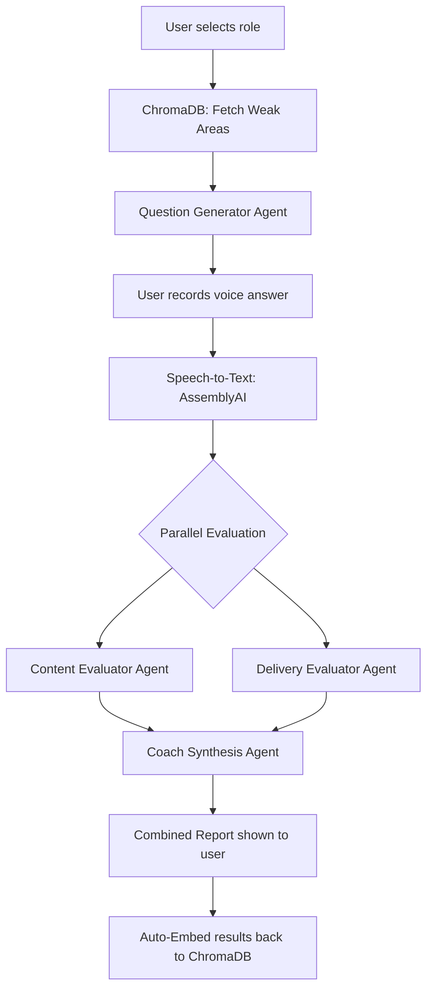

<div align="center">

# VocaPrep — AI-Powered Interview & Fluency Coach

**A voice-first, agentic AI interview simulator that evaluates both *what* you say and *how* you say it.**

[](https://react.dev)
[](https://nodejs.org)
[](https://www.mongodb.com/atlas)
[](https://langchain-ai.github.io/langgraphjs/)
[](LICENSE)

</div>

---

## The Problem

Most interview-prep tools evaluate **content only**. None evaluate **delivery** — filler words, pacing, pauses, and confidence — which is where candidates often lose interviews despite knowing the right answer.

**VocaPrep closes that gap.** It's a voice-based mock interview platform where an agentic AI pipeline evaluates **content accuracy** and **speech delivery** in the same session, tracking improvement over time. It uses **Vector Embeddings** and **RAG** (Retrieval-Augmented Generation) to analyze your weak points across sessions and tailor future questions specifically to help you improve.

---

## Key Features

| Feature | Description |
|---|---|
| **Agentic AI Evaluation** | A LangGraph-powered multi-agent pipeline (Content Evaluator → Delivery Evaluator → Coach Synthesis) processes answers in parallel for comprehensive feedback |
| **RAG-Personalized Questions** | Past interview transcripts and feedback are embedded into ChromaDB. Weak areas are semantically retrieved and injected into the question generation context |
| **Real-Time Fluency Metrics** | Calculates Words Per Minute (WPM), filler word rate, pause frequency/duration, and run-on sentence detection using AssemblyAI's word-level timestamps |
| **Voice Recording & Transcription** | In-browser audio recording via the Web Audio API with live waveform visualization, transcribed by AssemblyAI with word-level confidence scores |
| **Progress Dashboard** | Trend charts (Content Score, WPM, Filler Rate) built with Recharts, paginated session history, and AI-identified target areas |
| **Role-Based Interviews** | Choose from MERN Full-Stack, Frontend (React), Backend (Node.js), or General Behavioral interview tracks with configurable session settings |
| **Dark / Light Mode** | System-wide theme toggling with CSS custom properties, persisted in localStorage |
| **Premium Glassmorphism UI** | Hand-crafted design system using glass panels, premium shadows, and micro-animations via Framer Motion |

---

## Tech Stack

### Frontend

| Technology | Purpose |
|---|---|
| **React 19** | UI framework with hooks, lazy loading (`React.lazy` + `Suspense`), and memoization |
| **Vite 8** | Development server and build tooling |
| **Tailwind CSS v4** | Utility-first styling with CSS custom properties for theming |
| **Redux Toolkit** | Global state management (auth, interview, progress slices) |
| **React Router v7** | Client-side routing with protected routes |
| **Framer Motion** | Page transitions, hover effects, and micro-animations |
| **Recharts** | Data visualization (line charts for WPM, content score, filler rate trends) |
| **Lucide React** | Icon library |
| **Axios** | HTTP client with interceptors for JWT refresh |

### Backend

| Technology | Purpose |
|---|---|
| **Node.js + Express** | RESTful API server |
| **MongoDB Atlas + Mongoose** | Primary database for users, sessions, and progress snapshots |
| **ChromaDB** | Vector database for storing interview embeddings (RAG) |
| **LangChain.js + LangGraph.js** | Agentic AI orchestration — multi-node evaluation graph |
| **Google Gemini** | LLM for content evaluation, question generation, and coaching synthesis |
| **Gemini Embeddings** | `gemini-embedding-2` model for vectorizing interview transcripts |
| **AssemblyAI** | Speech-to-text with word-level timestamps for delivery analysis |
| **Cloudinary** | Audio file storage (uploaded recordings) |
| **JWT (jsonwebtoken)** | Stateless authentication with access tokens |
| **Winston** | Structured logging |

### Security

| Middleware | Protection |
|---|---|
| **Helmet** | HTTP security headers |
| **express-rate-limit** | Tiered rate limiting (Global: 100/15min, Auth: 10/hr, AI: 50/hr) |
| **express-mongo-sanitize** | NoSQL injection prevention |
| **xss-clean** | Cross-site scripting protection |
| **hpp** | HTTP parameter pollution prevention |
| **bcryptjs** | Password hashing |

### DevOps & Tooling

| Tool | Purpose |
|---|---|
| **Docker Compose** | ChromaDB container orchestration |
| **npm Workspaces** | Monorepo management (`client`, `server`, `shared`) |
| **ESLint + Prettier** | Code linting and formatting |
| **Husky + lint-staged** | Pre-commit hooks for code quality |
| **Concurrently** | Parallel dev server execution |
| **Nodemon** | Server hot-reloading in development |

---

## Architecture

VocaPrep uses a **MERN stack** combined with an **agentic AI pipeline** and a **vector database** for Retrieval-Augmented Generation (RAG).



### AI Pipeline (LangGraph)

The evaluation pipeline is built with **LangGraph.js** using a fan-out/fan-in pattern:

1. **Question Generator** — Uses RAG to pull historical weak areas from ChromaDB and generates role-specific, difficulty-scaled interview questions via Gemini
2. **Content Evaluator** — Analyzes the transcript for correctness, structure (STAR method), and relevance to the question
3. **Delivery Evaluator** — Computes fluency metrics from AssemblyAI's word-level timestamps:
   - Words Per Minute (WPM)
   - Filler word detection and rate calculation
   - Pause frequency, average length, and longest pause
   - Run-on sentence identification
4. **Coach Synthesis** — Merges content and delivery evaluations into a unified, actionable coaching report

### Database Layer

- **MongoDB Atlas** — Stores users, interview sessions (with embedded question attempts), and progress snapshots
- **ChromaDB (Docker)** — Vector store for semantic similarity search. Each completed question attempt is embedded and stored with metadata (role, score, date). This enables the RAG pipeline to identify and target the user's weakest topics

---

## Project Structure

```
VocaPrep/
├── client/                          # React frontend (Vite)
│   └── src/
│       ├── api/                     # Axios API modules (auth, session, audio, etc.)
│       ├── components/
│       │   ├── auth/                # Login & Register forms
│       │   ├── dashboard/           # Stats, charts, session history, weak areas
│       │   ├── feedback/            # Post-interview feedback display
│       │   ├── interview/           # Audio recorder, visualizer, question cards
│       │   ├── landing/             # Hero, features, how-it-works, CTA
│       │   ├── layout/              # Navbar, Footer, PageLayout, ProtectedRoute
│       │   └── ui/                  # Reusable components (Button, Badge, Modal, etc.)
│       ├── context/                 # ThemeContext (dark/light mode)
│       ├── hooks/                   # Custom hooks (useAudioRecorder, useRetry, etc.)
│       ├── pages/                   # Route-level page components
│       ├── store/                   # Redux Toolkit store + slices
│       └── styles/                  # CSS animations
├── server/                          # Express backend
│   └── src/
│       ├── ai/
│       │   ├── agents/              # LangGraph nodes (content, delivery, coach, question gen)
│       │   ├── delivery/            # Fluency analyzers (WPM, filler, pause, run-on)
│       │   ├── prompts/             # LangChain prompt templates
│       │   ├── evaluationGraph.js   # LangGraph pipeline definition
│       │   ├── graphState.js        # State schema for the evaluation graph
│       │   └── llmClient.js         # Gemini LLM client configuration
│       ├── config/                  # Database, env, logger, Cloudinary, ChromaDB
│       ├── controllers/             # Route handlers
│       ├── data/                    # Static question bank
│       ├── middleware/              # Auth, error handling, rate limiting, validation
│       ├── models/                  # Mongoose schemas (User, Session, ProgressSnapshot)
│       ├── routes/                  # Express route definitions
│       ├── services/                # Business logic (embedding, retrieval, transcription, etc.)
│       └── utils/                   # Utility functions
├── shared/                          # Shared constants and role definitions
├── docs/                            # Architecture, API, and E2E test documentation
├── docker-compose.yml               # ChromaDB container
├── package.json                     # Root workspace configuration
└── .env.example                     # Environment variable template
```

---

## Getting Started

### Prerequisites

- **Node.js** v18 or higher
- **Docker** (for ChromaDB vector database)
- **MongoDB** instance (local or [MongoDB Atlas](https://www.mongodb.com/atlas))
- API Keys:
  - [Google Gemini](https://ai.google.dev/) — LLM and embeddings
  - [AssemblyAI](https://www.assemblyai.com/) — Speech-to-text
  - [Cloudinary](https://cloudinary.com/) — Audio file storage

### 1. Clone the Repository

```bash
git clone https://github.com/your-username/VocaPrep-AI-Powered-Interview-Fluency-Coach.git
cd VocaPrep-AI-Powered-Interview-Fluency-Coach
```

### 2. Install Dependencies

The project uses **npm workspaces**, so a single install command at the root handles everything:

```bash
npm install
```

### 3. Configure Environment Variables

Copy the example environment file and fill in your keys:

```bash
cp .env.example server/.env
```

**`server/.env`**:

| Variable | Description | Required |
|---|---|---|
| `MONGODB_URI` | MongoDB connection string | ✅ |
| `JWT_SECRET` | Secret key for signing JWTs | ✅ |
| `GEMINI_API_KEY` | Google Gemini API key (for LLM + embeddings) | ✅ |
| `ASSEMBLYAI_API_KEY` | AssemblyAI API key (for speech-to-text) | ✅ |
| `CLOUDINARY_URL` | Cloudinary connection URL (for audio upload) | Optional |
| `CHROMA_URL` | ChromaDB server URL (default: `http://localhost:8000`) | Optional |
| `PORT` | Backend server port (default: `5000`) | Optional |

Create a client environment file:

```bash
echo "VITE_API_URL=http://localhost:5000/api" > client/.env
```

### 4. Start ChromaDB (Vector Database)

```bash
docker-compose up -d
```

This spins up a persistent ChromaDB instance on port `8000`.

### 5. Run the Application

Start both the frontend and backend concurrently:

```bash
npm run dev
```

Or run them individually:

```bash
# Terminal 1 — Backend (port 5000)
npm run dev:server

# Terminal 2 — Frontend (port 5173)
npm run dev:client
```

### 6. Open in Browser

Navigate to **[http://localhost:5173](http://localhost:5173)**

---

## API Endpoints

### Authentication (`/api/auth`)

| Method | Endpoint | Description | Rate Limit |
|---|---|---|---|
| `POST` | `/register` | Register a new user | 10/hr |
| `POST` | `/login` | Authenticate and receive JWT | 10/hr |
| `GET` | `/me` | Get current authenticated user | 10/hr |

### Users (`/api/users`)

| Method | Endpoint | Description |
|---|---|---|
| `GET` | `/profile` | Get user profile |
| `PUT` | `/profile` | Update user profile |

### Sessions (`/api/sessions`)

| Method | Endpoint | Description |
|---|---|---|
| `POST` | `/start` | Initialize a new interview session |
| `POST` | `/:sessionId/complete` | Complete session and trigger ChromaDB embeddings |
| `GET` | `/history` | Get paginated session history |
| `GET` | `/:sessionId` | Get detailed session results |

### Audio & Transcription (`/api/audio`, `/api/transcription`)

| Method | Endpoint | Description |
|---|---|---|
| `POST` | `/api/audio/upload` | Upload audio blob to Cloudinary |
| `POST` | `/api/transcription/transcribe` | Transcribe audio via AssemblyAI |

### AI Pipeline (`/api/questions`, `/api/evaluate`)

| Method | Endpoint | Description | Rate Limit |
|---|---|---|---|
| `POST` | `/api/questions/generate` | Generate RAG-personalized interview question | 50/hr |
| `POST` | `/api/evaluate/answer` | Full LangGraph evaluation pipeline | 50/hr |

### Progress (`/api/progress`)

| Method | Endpoint | Description |
|---|---|---|
| `GET` | `/dashboard` | Aggregate stats, score trends, WPM trends |
| `GET` | `/weak-areas` | Retrieve weak topics via vector similarity search |

---

## Available Scripts

| Script | Description |
|---|---|
| `npm run dev` | Start both client and server concurrently |
| `npm run dev:client` | Start only the Vite dev server |
| `npm run dev:server` | Start only the Express dev server (with Nodemon) |
| `npm run build` | Build the frontend for production |
| `npm run start` | Start the production server |
| `npm run lint` | Run ESLint across the project |
| `npm run lint:fix` | Auto-fix linting issues |
| `npm run format` | Format code with Prettier |

---

## Performance Optimizations

- **Code Splitting** — Route-level lazy loading with `React.lazy` and `Suspense` for all page components
- **Memoization** — `useMemo` and `useCallback` for expensive computations (chart data, score aggregations)
- **DOM-Level Animations** — Framer Motion and CSS animations bypass React's render lifecycle
- **Custom Hooks** — Encapsulated, reusable logic (`useAudioRecorder`, `useRetry`, `useSessionPersistence`, `useMicrophonePermission`)
- **Optimized API Layer** — Axios interceptors for automatic JWT attachment and token refresh

---

## Documentation

| Document | Description |
|---|---|
| [Architecture Guide](docs/ARCHITECTURE.md) | System components, LangGraph pipeline diagram, security & performance notes |
| [API Documentation](docs/API.md) | Complete REST API reference with endpoints and rate limits |
| [E2E Test Checklist](docs/E2E_TEST_CHECKLIST.md) | Manual end-to-end testing checklist covering all user flows |

---

## License

This project is licensed under the **MIT License**. See the [LICENSE](LICENSE) file for details.
