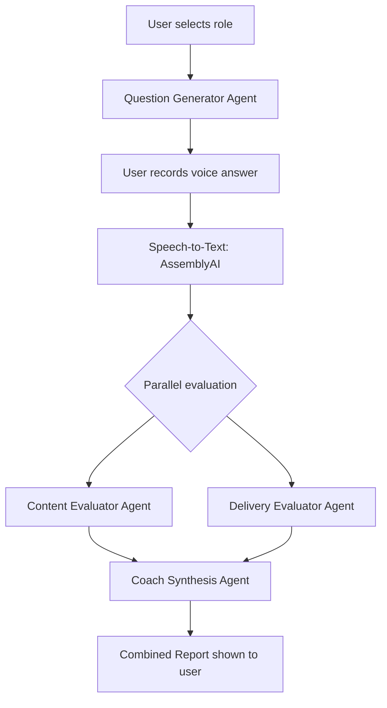

# VocaPrep Architecture

VocaPrep uses a modern MERN stack combined with an agentic AI pipeline.

## System Components

1. **Frontend (React)**: Handles user interaction, Web Audio API recording, and visualization.
2. **Backend (Express)**: Manages authentication, database operations, audio proxying, and AI orchestration.
3. **LangGraph Pipeline**:
   - _Question Generator_: Pulls role context and past weaknesses to generate tailored questions.
   - _Content Evaluator_: Analyzes transcript for correctness and structure (STAR).
   - _Delivery Evaluator_: Computes WPM, filler word rates, and pauses from word-level timestamps.
   - _Coach Synthesis_: Combines content and delivery evaluations into actionable feedback.

## Graph Diagram

