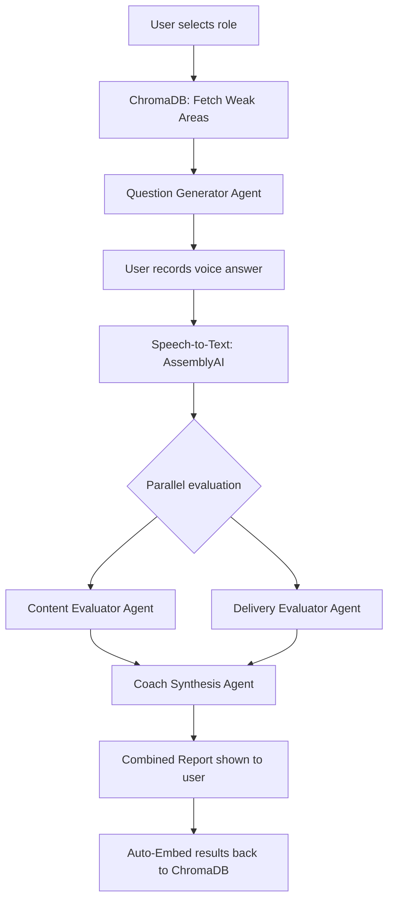

# VocaPrep Architecture

VocaPrep uses a modern MERN stack combined with an agentic AI pipeline and a Vector Database for Retrieval-Augmented Generation (RAG).

## System Components

1. **Frontend (React)**: Handles user interaction, Web Audio API recording, dynamic visualizations (framer-motion), and performance-optimized routing.
2. **Backend (Express)**: Manages authentication, database operations, security middleware (Rate Limiting, Helmet, NoSQL sanitization), audio proxying, and AI orchestration.
3. **Database Layer**:
   - **MongoDB Atlas**: Stores standard application data (Users, Sessions, Progress stats).
   - **ChromaDB (Docker)**: Stores vector embeddings of user transcripts and feedback. Allows for semantic similarity search to identify "weak areas."
4. **LangGraph Pipeline**:
   - _Question Generator_: Uses RAG to pull historical weak areas from ChromaDB, injecting them into the context window to generate tailored questions.
   - _Content Evaluator_: Analyzes transcript for correctness and structure (STAR method).
   - _Delivery Evaluator_: Computes WPM, filler word rates, and pauses utilizing AssemblyAI's word-level timestamps.
   - _Coach Synthesis_: Combines content and delivery evaluations into a cohesive, actionable feedback report.

## Graph Diagram (LangGraph)

## Security & Performance

- **Security**: The Express backend is wrapped in `helmet`, `xss-clean`, `hpp`, and `express-mongo-sanitize`. Distinct rate-limiting tiers are applied to public, authentication, and expensive AI endpoints.
- **Performance**: The frontend utilizes `React.lazy` and `Suspense` for route-level code splitting. Heavy array reductions and chart data are memoized via `useMemo` and `useCallback`. Mouse tracking and animations rely on DOM refs or `framer-motion` to bypass React's render lifecycle.
